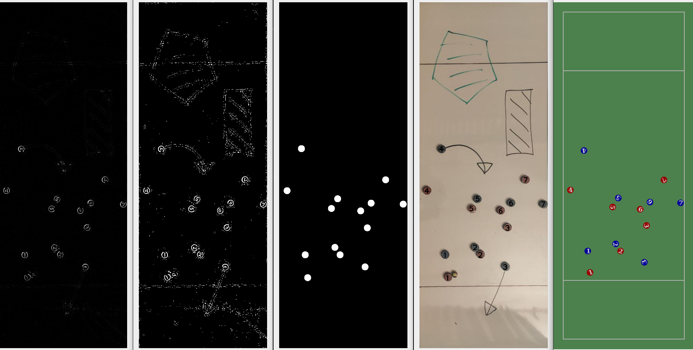
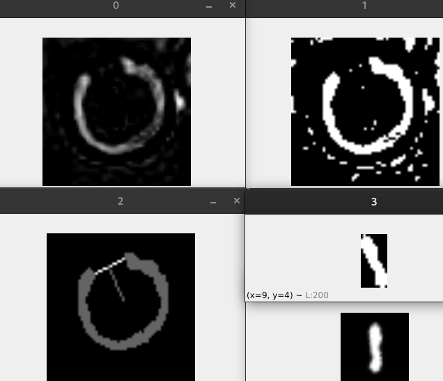
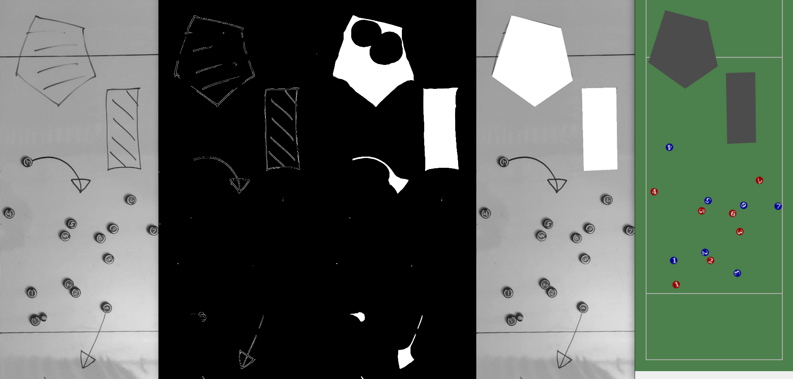

Ultimate Tactic Board
===
Python project for generating ultimate frisbee tactic animation from photos of tactic board

About
---
This project aims to facilitate the creation of ultimate frisbee playbooks.
It employs traditional and ml-based computer vision techiques to recognize e.g. player poses and disc position.
The below examples also hint future features like recognizing marked areas and arrows.
Currently, the program converts a single photo to a still tactical drawing or a series of photos to a mp4 animation.

Note that this project is WIP and may develop in any direction.
The following extensions are most likely:
 - recognizing the disc ;)
 - integrating textual descriptions (general and player-specific)
 - supporting arrows
   - for player movements
   - for the disc flight path
 - supporting marked areas
 - a convenient gui for creating and editing plays

Installation
---
`pip install requirements.txt`

Usage
---
`python main.py`

Example Images
---
### locate players

### compensate for orientation and recognize digit

### detect hand-drawn areas

